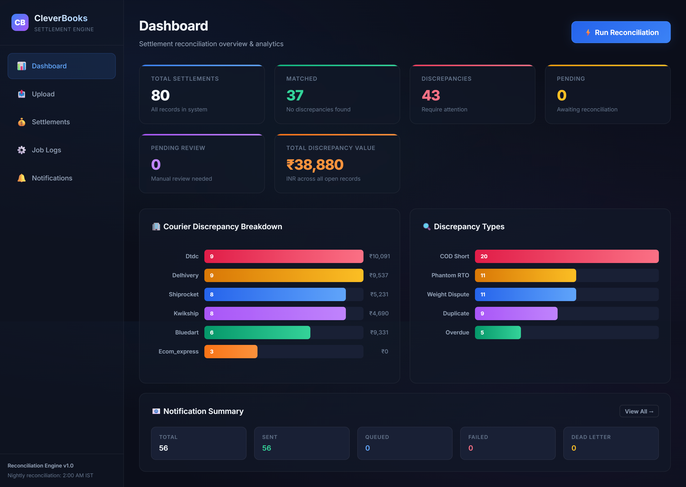
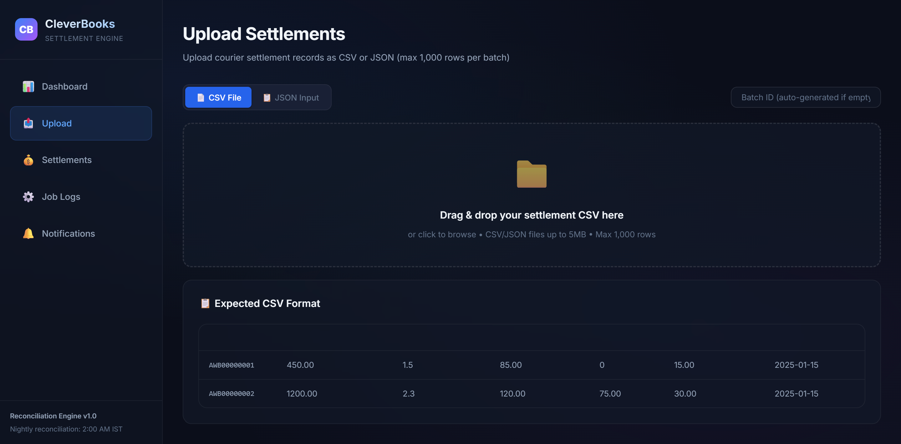
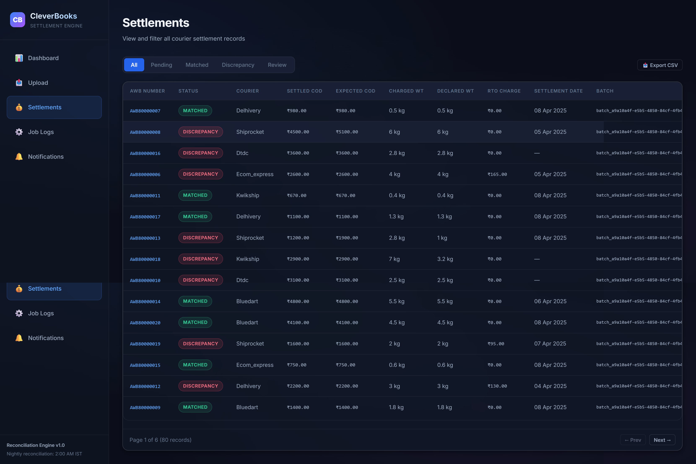
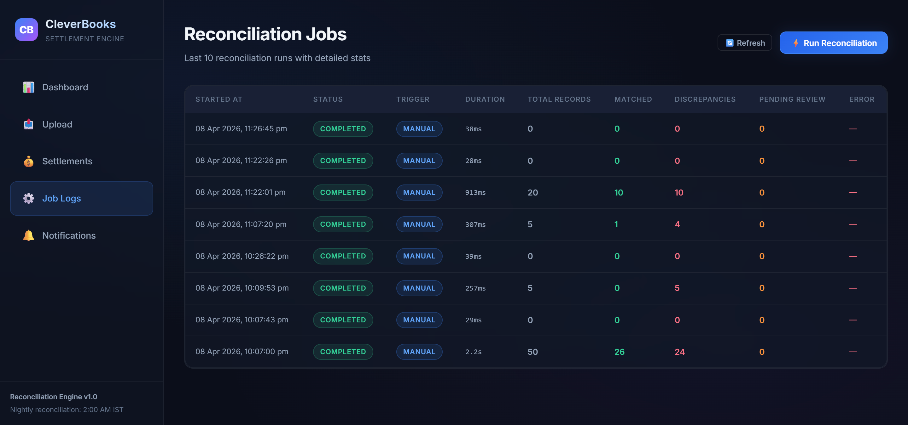

# CleverBooks — Courier Settlement Reconciliation & Alert Engine

> A MERN-stack system for automated courier settlement reconciliation, discrepancy detection, and merchant notification.


---

## 🏗 Architecture

```
┌─────────────┐    ┌──────────────┐    ┌──────────────┐    ┌─────────────────┐
│  React UI   │───▶│  Express API │───▶│   MongoDB    │    │   Pipedream     │
│  (Vite)     │    │  (Backend)   │    │  (Atlas)     │    │  (Notifications) │
│  Port 5173  │    │  Port 5000   │    └──────────────┘    └────────▲────────┘
└─────────────┘    └──────┬───────┘                                │
                          │                                         │
                   ┌──────▼───────┐    ┌──────────────┐            │
                   │  node-cron   │───▶│  BullMQ      │────────────┘
                   │  Scheduler   │    │  (Redis)     │  Notification Worker
                   │  2AM IST     │    │  DLQ + Retry │
                   └──────────────┘    └──────────────┘
```

### Queue-Based Decoupling (Hard Requirement)

The reconciliation engine does **NOT** directly send notifications. Instead:

1. **Reconciler** detects discrepancies and publishes events to a **BullMQ queue**
2. A **separate Worker** consumes events from the queue and calls the external notification API
3. Failed notifications are retried with **exponential backoff** (2s → 4s → 8s → 16s → 32s)
4. Permanently failed notifications are moved to a **Dead-Letter Queue (DLQ)**

---

## 🚀 Setup Instructions

### Prerequisites

- **Node.js** 20+
- **Redis** (local or Docker) — required for BullMQ queue
- **MongoDB** — Atlas cluster is pre-configured

### Option 1: Docker Compose (Recommended)

```bash
# Clone the repo
git clone <repo-url> && cd cleverbooks

# Webhook URL is pre-configured to Pipedream
# Override if needed: echo "WEBHOOK_URL=https://your-endpoint.m.pipedream.net" > .env

# Start everything
docker-compose up --build
```

- **Frontend:** http://localhost:3000
- **Backend API:** http://localhost:5000
- **Health Check:** http://localhost:5000/api/health

### Option 2: Manual Setup (npm)

**1. Start Redis** (required for the notification queue)

```bash
# Using Docker:
docker run -d -p 6379:6379 redis:7-alpine

# Or install Redis natively
```

**2. Backend**

```bash
cd backend
npm install

# Configure environment (edit .env)
# WEBHOOK_URL is pre-configured to Pipedream endpoint

# Seed the database with 55 orders + intentional discrepancies
npm run seed

# Start the server
npm run dev
```

**3. Frontend**

```bash
cd frontend
npm install
npm run dev
```

- **Frontend:** http://localhost:5173
- **Backend API:** http://localhost:5000

### Webhook / Notification Endpoint

Notifications are sent to a **Pipedream** endpoint (pre-configured):
- URL: `https://eowfw1pta25ghwn.m.pipedream.net`
- Set in `backend/.env` as `WEBHOOK_URL`
- To use a different endpoint, update `WEBHOOK_URL` in `.env`

---

## 🎯 Demo Walkthrough

1. **Seed Data:** Run `npm run seed` in the backend — creates 55 orders + 50 settlements with intentional discrepancies
2. **Open Dashboard:** Go to http://localhost:5173
3. **Upload Sample JSON:** Navigate to the "Upload" tab on the dashboard, select JSON, and paste the contents of the `sample_upload.json` file provided in the root directory (this payload contains specialized edge cases to trigger all 5 reconciliation rules).
4. **Run Reconciliation:** Click "⚡ Run Reconciliation" on the dashboard
5. **See Results:** The dashboard shows matched/discrepancy/pending counts, courier breakdown charts
6. **View Settlements:** Navigate to "Settlements" tab, filter by DISCREPANCY status
7. **Click AWB Number:** Opens detailed modal showing expected vs. actual values and all flagged rules
8. **Check Notifications:** Navigate to "Notifications" tab to see delivery status
9. **Verify Webhook:** Check Pipedream — you'll see the notification payloads with merchant ID, AWB, and suggested actions

---

## 🔍 Discrepancy Detection Rules (All 5 Implemented)

| # | Rule | Logic |
|---|------|-------|
| 1 | **COD Short-remittance** | `settledCodAmount < codAmount − tolerance` (tolerance = min(2%, ₹10)) |
| 2 | **Weight Dispute** | `chargedWeight > declaredWeight × 1.10` |
| 3 | **Phantom RTO Charge** | `rtoCharge > 0` but `orderStatus = DELIVERED` |
| 4 | **Overdue Remittance** | `deliveryDate > 14 days ago` but `settlementDate` is null |
| 5 | **Duplicate Settlement** | Same `awbNumber` appears in more than one batch |

---

## 📡 API Endpoints

| Method | Endpoint | Description |
|--------|----------|-------------|
| POST | `/api/settlements/upload` | Upload batch (CSV file or JSON body) |
| GET | `/api/settlements` | List + filter (?status=DISCREPANCY) |
| GET | `/api/settlements/:awbNumber` | Detail view for one record |
| GET | `/api/settlements/stats/summary` | Summary stats for dashboard |
| GET | `/api/settlements/export/csv` | Export filtered records as CSV |
| GET | `/api/jobs` | Reconciliation job history |
| POST | `/api/jobs/trigger` | Manual reconciliation trigger |
| GET | `/api/notifications` | Notification delivery log |
| GET | `/api/notifications/stats` | Notification statistics |
| POST | `/api/notifications/:id/retry` | Retry a dead-letter notification |

---

## 🏆 Bonus Features Implemented

### Technical Bonus
- ✅ **Retry with exponential backoff** on notification failure (2s → 4s → 8s → 16s → 32s)
- ✅ **Dead-letter queue** for permanently failed notifications
- ✅ **Rate-limit protection** on upload endpoint (max 5 req/min)
- ✅ **Timezone-aware scheduling** (IST — `Asia/Kolkata`, not UTC)
- ✅ **Idempotency key** on external API calls (prevents duplicate notifications)
- ✅ **Batch idempotency** — re-uploading the same batchId is rejected

### Product Bonus
- ✅ **Summary card** — total discrepancy value in INR across all open records
- ✅ **Courier-level breakdown chart** — which courier has most disputes
- ✅ **Discrepancy type breakdown chart** — which rules fire most often
- ✅ **Export filtered settlements to CSV**
- ✅ **Seed data generator script** — 55 orders + 50 settlements with intentional discrepancies

---

## 🎨 Design Decisions

### 1. BullMQ over in-memory queue
BullMQ backed by Redis is production-grade — it provides persistence, retries, rate limiting, and dead-letter queues out of the box. An in-memory EventEmitter would be simpler but loses events on server restart.

### 2. Compound index for idempotency
`(awbNumber, batchId)` compound unique index in MongoDB prevents duplicate settlement records within the same batch while allowing the same AWB to appear in different batches (which is needed for the "duplicate settlement" detection rule).

### 3. node-cron with timezone support
Using `node-cron` with the `timezone: 'Asia/Kolkata'` option ensures the scheduled reconciliation runs at 2:00 AM IST regardless of the server's system timezone.

### 4. Decoupled reconciliation and notification
The reconciler publishes events to a queue. A separate worker consumes them. This means:
- The reconciliation job completes fast (doesn't wait for HTTP calls)
- Notification failures don't block reconciliation
- We can scale the worker independently

### 5. All 5 rules implemented
Rather than the minimum 3, all 5 discrepancy rules are implemented to demonstrate thoroughness.

---

## 📋 Assumptions

1. **MongoDB Atlas** is used as the database (connection string in `.env`)
2. **Redis** is required for the BullMQ queue — if Redis is unavailable, the server still starts but notifications won't be processed
3. **Tolerance for COD Short-remittance** = min(2% of codAmount, ₹10) as specified
4. **Settlement batch re-upload** with the same batchId is rejected (409 Conflict)
5. **Ordering of discrepancy rules** — all 5 rules run on every settlement, and multiple discrepancies can flag on a single record
6. **Partial batch failures** — if some records in a batch have duplicate AWBs, the valid records are still inserted (using `ordered: false`)
7. **Notification payload** includes: merchantId, awbNumber, discrepancyType, expectedValue, actualValue, suggestedAction
8. **Timezone** — all scheduled operations assume IST (Asia/Kolkata)

---

## 🔮 What I'd Improve With More Time

1. **Authentication & multi-tenancy** — merchant login, data isolation per merchant
2. **WebSocket/SSE** for real-time dashboard updates when reconciliation completes
3. **Bulk operations** — mark multiple settlements as reviewed, bulk dispute filing
4. **Email templates** — HTML email notifications via SendGrid instead of webhook
5. **Test suite** — unit tests for reconciliation rules, integration tests for API endpoints
6. **Rate limiting** — move to Redis-backed rate limiting for multi-instance deployments
7. **Monitoring** — BullMQ dashboard (Bull Board) for queue monitoring
8. **Partial reconciliation** — ability to reconcile only specific batches or date ranges
9. **Audit trail** — log who triggered reconciliation, who reviewed discrepancies
10. **CI/CD** — GitHub Actions for build, test, deploy

---

## 📁 Project Structure

```
cleverbooks/
├── backend/
│   ├── config/
│   │   ├── db.js              # MongoDB connection
│   │   └── queue.js           # BullMQ queue setup (Redis)
│   ├── controllers/
│   │   ├── settlementController.js  # Upload, list, detail, stats, export
│   │   ├── jobController.js         # Job history, manual trigger
│   │   └── notificationController.js # Notification logs, retry
│   ├── jobs/
│   │   └── scheduledReconciliation.js # Cron job (2AM IST)
│   ├── middleware/
│   │   ├── errorHandler.js    # Global error handling
│   │   └── rateLimiter.js     # Upload rate limit (5/min)
│   ├── models/
│   │   ├── Order.js           # Merchant order schema
│   │   ├── Settlement.js      # Courier settlement schema
│   │   ├── Job.js             # Reconciliation job logs
│   │   └── Notification.js    # Notification delivery log
│   ├── routes/
│   │   ├── settlements.js
│   │   ├── jobs.js
│   │   └── notifications.js
│   ├── services/
│   │   ├── reconciler.js      # Core reconciliation engine (5 rules)
│   │   └── notifier.js        # Notification helpers
│   ├── utils/
│   │   ├── csvParser.js       # CSV parse/export utility
│   │   └── seedData.js        # Seed data generator (55 orders)
│   ├── workers/
│   │   └── notificationWorker.js  # BullMQ worker (Pipedream)
│   ├── .env
│   ├── Dockerfile
│   ├── package.json
│   └── server.js
├── frontend/
│   ├── src/
│   │   ├── components/
│   │   │   ├── Dashboard.jsx  # Stats, charts, summary
│   │   │   ├── Upload.jsx     # CSV/JSON upload
│   │   │   ├── Settlements.jsx # Table, filter, detail modal
│   │   │   ├── JobLogs.jsx    # Reconciliation history
│   │   │   ├── Notifications.jsx # Delivery log + retry
│   │   │   └── Sidebar.jsx    # Navigation
│   │   ├── api.js             # API client
│   │   ├── App.jsx            # Root component
│   │   ├── main.jsx           # Entry point
│   │   └── index.css          # Design system
│   ├── Dockerfile
│   ├── nginx.conf
│   ├── index.html
│   └── package.json
├── docker-compose.yml
└── README.md
```

---

## 📸 Screenshots

### Dashboard


### Upload Settlements


### Settlements Table & Discrepancies


### Notifications & Job Logs


---

## 🎬 Loom Video

[Insert Loom link here]

---

**Built by Rahul Sannamath** | CleverBooks Founding Engineer Assignment
